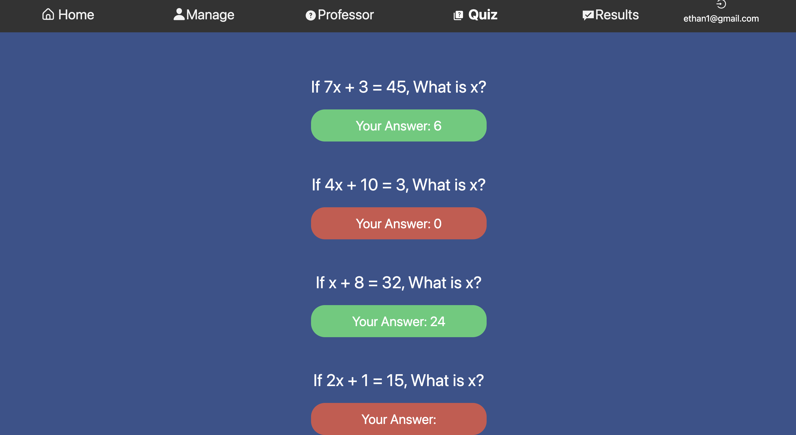

# quiz_platform
This project is intended to help students study and track their progress over time

Project Console: https://console.firebase.google.com/project/quiz-6ceb9/overview  

The front end is build using React and the back end is build using JavaScript and Firestore. 

When logging in, any email is valid. The password can also be whatever you would like, any 6 digit string would suffice.

Login page:

When logged in, the home page is where you will be routed. You can hover over the question mark in the bottom left to see where the different options in the nav bar take you.

Home page:

Under the quiz tab, you can take quizzes and see your results live.

Quiz page:

Track your progress and see previous results in the results tab.

Results page:

Allow friends access to your quizzes and create courses/groups in the manage tab.

Manage page:

Hosting URL: https://quiz-6ceb9.web.app

To deploy run the following commands:

npm run build  
npm run export  
firebase deploy  

